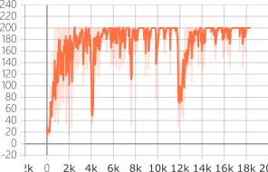
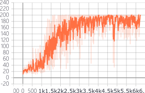
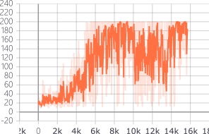
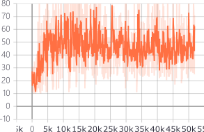

# POMDP-ac-cartpole
solving POMDP by LSTM in gym.cartpole environment, in pytorch

## Requirements 

- tensorflow (for tensorboard logging)
- pytorch (>=1.0, 1.0.1 used in my experiment)
- gym

## POMDP setting

the ideal of convert Cartpole-v0 into a POMDP task comes from [HaiyinPiao](https://github.com/HaiyinPiao/pytorch-a2clstm-DRQN)

and the full observation of cartpole in gym is in 4 dimensions :
0. cart position (-4.8, 4.8)
1. cart velocity (-inf, inf)
2. pole angle (-24°, 24°)
3. pole velocity at tip (-inf, inf)

and we can delete one or more dimensions of the standard states and make the task become a partial observed markov decision process(POMDP).

## Delete the cart velocity
LSTM | no LSTM
:-:|:-:
|

## Delete the cart velocity and pole velocity
LSTM | no LSTM
:-:|:-:
|

## Conclusion
When the partial observability becomes more severe, LSTM would significantly improving the performance of RL agent.

